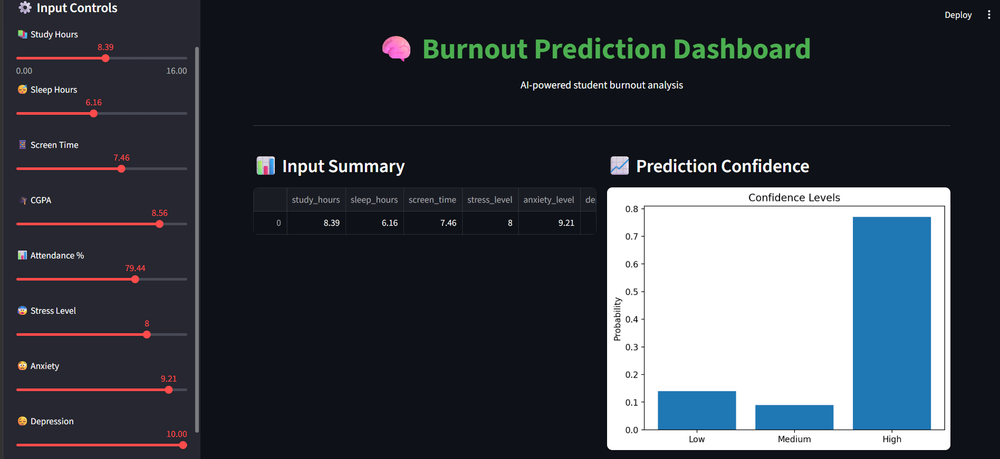
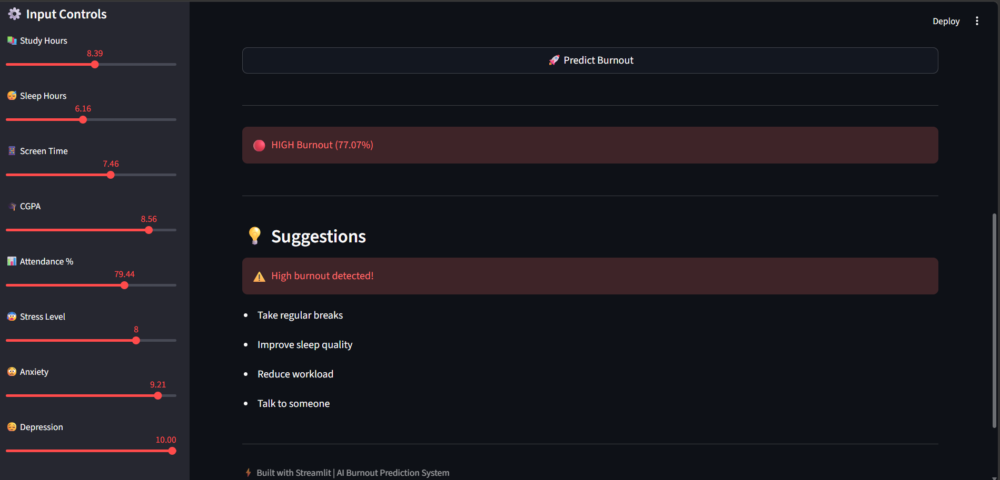

# 🧠 Burnout Prediction Dashboard

## 🚀 AI-Powered Student Burnout Detection System

🔗 **GitHub Repository:**
https://github.com/kumarvyshnav07/burnout-risk-predictor

---

## 📌 Overview

This project is an **AI-powered burnout prediction system** that analyzes student lifestyle and mental health factors to predict burnout levels:

* 🟢 **Low Risk**
* 🟡 **Medium Risk**
* 🔴 **High Risk**

The system provides **real-time predictions, confidence scores, and personalized suggestions** to help users manage stress effectively.

---

## 🎯 Features

* 📊 Predict burnout level instantly
* 🧠 Powered by **XGBoost Machine Learning model**
* 📈 Displays prediction confidence graph
* 💡 Provides personalized suggestions
* 🎯 Achieves **~96% accuracy with cross-validation**
* 🖥️ Interactive dashboard built with Streamlit

---

## 🧠 Tech Stack

* **Programming Language:** Python
* **Libraries:** Pandas, NumPy, Scikit-learn
* **ML Model:** XGBoost
* **Visualization:** Matplotlib
* **Deployment/UI:** Streamlit
* **Model Saving:** Joblib

---

## 📊 Model Performance

* ✅ Accuracy: **~96%**
* ✅ Cross-validation score: **~96%**
* ✅ Balanced Precision & Recall across all classes
* ✅ Robust to noise (realistic synthetic dataset)

---

## 📂 Project Structure

```
burnout-risk-predictor/
│
├── BURNapp.py              # Streamlit dashboard app
├── burnout_model.py        # Model training script
├── burnout_model.pkl       # Trained ML model
├── README.md               # Documentation
├── imgb1.png               # Dashboard screenshot
├── imgb2.png               # Prediction output
```

---

## ▶️ How to Run Locally

### 1️⃣ Clone the Repository

```bash
git clone https://github.com/kumarvyshnav07/burnout-risk-predictor.git
cd burnout-risk-predictor
```

### 2️⃣ Install Dependencies

```bash
pip install numpy pandas scikit-learn xgboost matplotlib streamlit joblib
```

### 3️⃣ Run the Application

```bash
streamlit run BURNapp.py
```

### 4️⃣ Open in Browser

```
http://localhost:8501/
```

---

## 📸 Preview

### 🔹 Dashboard UI



### 🔹 Prediction Result



---

## 🌐 Live Demo

👉 
https://your-app-name.streamlit.app

---

## 💡 Key Highlights

* Uses **realistic synthetic dataset with noise**
* Avoids overfitting and unrealistic 100% accuracy
* Follows proper **ML pipeline practices**
* Clean, simple, and user-friendly UI
* Designed as a **real-world portfolio project**

---

## ⚠️ Limitations

* Uses synthetic dataset (not clinical data)
* Predictions are indicative, not medical advice
* Model may need retraining for different populations

---

## 🔮 Future Improvements

* 🌐 Deploy fully online (Streamlit Cloud / Render)
* 🧠 Add SHAP explainability
* 📊 Add analytics dashboard (charts & trends)
* 🎨 Improve UI/UX with advanced styling
* 📱 Mobile-friendly version

---

## 🤝 Contributing

Contributions are welcome!
Feel free to fork this repository and submit pull requests.

---

## 👨‍💻 Author

**Kumar Vyshnav Pampina**
🔗 GitHub: https://github.com/kumarvyshnav07

---

## ⭐ Support

If you like this project:
👉 Give it a ⭐ on GitHub
👉 Share it with others

---

## 🏁 Final Note

This project demonstrates:

* Machine Learning skills
* Real-world problem solving
* End-to-end deployment readiness

---
